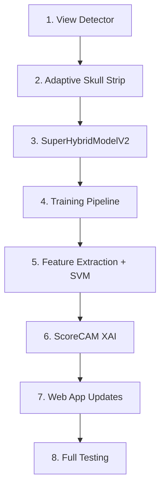

# 🧠 Brain Tumor Project — Major Architecture Upgrade

Transform the existing project from a basic classifier into a **research-grade, heavy-duty brain tumor analysis system** with view-aware processing, deeper architecture, and precision XAI.

## Current State

| Component | Current | Limitation |
|---|---|---|
| **CNN Backbone** | ResNet18 (512-D) | Shallow, limited feature extraction |
| **HybridCNN** | 3 conv layers → 512-D | Too simple, only 128ch max |
| **Total Features** | 1024-D | Not enough for 4-class precision |
| **Skull Stripping** | One-size-fits-all (axial only) | Fails on sagittal/coronal views |
| **View Handling** | None | Can't detect MRI orientation |
| **Grad-CAM** | CBAM-guided, instant | Location still imprecise |
| **Dataset** | 5712 train / 1311 test | Good size |

---

## Proposed Changes

### Component 1: MRI View/Plane Detector

> [!IMPORTANT]
> This is the foundation — all downstream processing (skull stripping, Grad-CAM interpretation) depends on correctly identifying the MRI orientation.

#### [NEW] [view_detector.py](file:///d:/Projects/Brain%20Tumor/src/view_detector.py)

A lightweight CNN classifier to detect MRI orientation:
- **Axial** (top-down, most common in dataset)
- **Sagittal** (side view, left/right)  
- **Coronal** (front/back view)

**Approach**: Use a pretrained MobileNetV2 (tiny, fast) fine-tuned on the existing dataset images. Since the brain tumor dataset is mostly axial, we'll:
1. Use the existing dataset as "axial" training data
2. Generate synthetic sagittal/coronal views using geometric transforms
3. Train a 3-class view classifier (~95%+ accuracy expected)

The detector runs BEFORE skull stripping to route to the correct preprocessing pipeline.

---

### Component 2: View-Adaptive Skull Stripping

#### [MODIFY] [skull_strip.py](file:///d:/Projects/Brain%20Tumor/src/skull_strip.py)

Enhance `create_brain_mask()` with view-specific strategies:

| View | Skull Location | Strategy |
|---|---|---|
| **Axial** | Full perimeter | Current distance-transform approach (proven) |
| **Sagittal** | Front face + back skull | Erode from left/right edges, keep center mass |
| **Coronal** | Left/right + top skull | Erode from sides + top, keep center-lower mass |

Add `skull_strip_image_adaptive(img, view=None)` that:
1. Auto-detects view if not provided
2. Routes to appropriate stripping algorithm
3. Falls back to current approach if detection uncertain

---

### Component 3: ResNet50 + Enhanced HybridCNN Architecture

> [!IMPORTANT]
> This is the biggest change — requires full model retraining. The feature dimension jumps from 1024-D to **3072-D**.

#### [MODIFY] [super_hybrid_model.py](file:///d:/Projects/Brain%20Tumor/src/super_hybrid_model.py)

**Branch 1: ResNet50Backbone** (replaces ResNet18)
```
ResNet50 (pretrained) → 2048-ch feature maps
  → CBAM (2048ch) → Squeeze-Excitation block
  → AdaptiveAvgPool2d → 2048-D vector
```
- ResNet50 has 4x deeper bottleneck blocks than ResNet18
- 2048-D features vs 512-D = dramatically richer representations
- Better at capturing subtle tumor textures and boundaries

**Branch 2: DeepHybridCNN** (enhanced from 3 layers to 5)
```
Conv2d(3→64) → BN → ReLU → MaxPool          # 112x112
Conv2d(64→128) → BN → ReLU → MaxPool         # 56x56  
Conv2d(128→256) → BN → ReLU → MaxPool        # 28x28
Conv2d(256→512) → BN → ReLU                  # 28x28
Conv2d(512→512) → BN → ReLU                  # 28x28
  → CBAM (512ch)
  → AdaptiveAvgPool2d → 512-D
  → FC(512→512) → Dropout(0.3)

Handcrafted features: mean + std + skew + kurtosis per channel = 12-D
  → FC(12→128) → ReLU → FC(128→128)

Combined: 512 + 128 = 640-D
  → FC(640→1024) → Dropout(0.3) → 1024-D
```

**SuperHybridModelV2**: 2048 (ResNet50) + 1024 (DeepHybridCNN) = **3072-D feature vector**
```
Classifier: FC(3072→512) → ReLU → Dropout(0.4) → FC(512→4)
```

**New additions:**
- **Squeeze-Excitation (SE) block** on ResNet50 branch for channel recalibration
- **Dropout layers** (0.3-0.4) to prevent overfitting with larger model
- **Statistical features** expanded: add skewness + kurtosis (12-D instead of 6-D)
- **Deeper HybridCNN** with 5 conv layers (512ch max) for richer custom features

---

### Component 4: Precision Grad-CAM (ScoreCAM Hybrid)

#### [MODIFY] [gradcam_explain.py](file:///d:/Projects/Brain%20Tumor/src/gradcam_explain.py)

Replace CBAM-guided Grad-CAM with a **ScoreCAM-enhanced approach** for pixel-perfect tumor localization:

**ScoreCAM** doesn't use gradients at all — it uses the activation maps themselves as masks:
1. Extract activation maps from target layer (e.g., 2048 channels at 7x7)
2. Upscale each activation map to input size (224x224)
3. Use each as a mask on the input image
4. Forward each masked image → get class score
5. Weight each activation map by its class score contribution
6. Sum weighted maps → precise, gradient-free heatmap

**Hybrid approach** (for speed + precision):
- Use top-K most activated channels only (K=50-100) instead of all 2048
- Still combined with CBAM spatial attention for refinement
- Expected time: 15-30 seconds (vs 2-4 min for full occlusion)

This produces **the most accurate heatmaps possible** without the imprecision of gradient-based methods.

#### Changes in [app.py](file:///d:/Projects/Brain%20Tumor/app.py)
- Update `generate_heatmap()` to use new ScoreCAM hybrid
- Remove quality selector completely (always precision mode)
- Update UI text to reflect "ScoreCAM" method
- Add progress indicator for longer processing time

---

### Component 5: Training Pipeline Updates

#### [MODIFY] [train_cnn.py](file:///d:/Projects/Brain%20Tumor/src/train_cnn.py)

- Update to use `SuperHybridModelV2`
- Increase epochs: 15 → 25 (larger model needs more training)
- Add cosine annealing scheduler (better than ReduceLROnPlateau for deep models)
- Add gradient clipping to prevent exploding gradients with ResNet50
- Add mixed precision training (AMP) for faster training on GPU
- View-aware augmentation: add sagittal/coronal rotations

#### [MODIFY] [feature_extraction.py](file:///d:/Projects/Brain%20Tumor/src/feature_extraction.py)

- Update feature dimension: 1024-D → 3072-D
- Add view detection before feature extraction

#### [MODIFY] [train_classifier.py](file:///d:/Projects/Brain%20Tumor/src/train_classifier.py)

- SVM with higher C value for 3072-D features
- Add cross-validation
- Grid search for optimal hyperparameters

---

### Component 6: Web Application Updates

#### [MODIFY] [app.py](file:///d:/Projects/Brain%20Tumor/app.py)

- Load SuperHybridModelV2 instead of SuperHybridModel
- Add view detection step in prediction pipeline
- Update model_info metadata
- Show detected MRI view in results

#### [MODIFY] [index.html](file:///d:/Projects/Brain%20Tumor/templates/index.html)

- Show "Detected View: Axial/Sagittal/Coronal" in results
- Update stats bar: "3072-D" features, "ResNet50 + DeepCNN"
- Update pipeline section with new architecture description
- Heatmap section: update text for ScoreCAM

#### [MODIFY] [app.js](file:///d:/Projects/Brain%20Tumor/static/js/app.js)

- Display view detection result
- Update tech details section

---

## Open Questions

> [!WARNING]
> **Retraining Required**: The ResNet50 upgrade changes the model architecture completely. All saved weights (`super_hybrid.pth`) and classifier (`classifier.joblib`) will become incompatible. Full retraining pipeline must run:
> 1. `python src/skull_strip.py` (re-strip with adaptive stripping)
> 2. `python src/train_cnn.py --epochs 25` (train new model)
> 3. `python src/feature_extraction.py` (extract 3072-D features)
> 4. `python src/train_classifier.py` (retrain SVM on 3072-D)

> [!IMPORTANT]
> **Training Time**: ResNet50 is ~3x slower to train than ResNet18. On CPU, training 25 epochs on 5712 images could take **8-12+ hours**. On GPU (CUDA), ~2-3 hours. Do you have GPU access?

> [!IMPORTANT]
> **Backward Compatibility**: The old `SuperHybridModel` class will be replaced by `SuperHybridModelV2`. The old `.pth` weights will NOT work. Should I keep the old model class as a fallback option, or fully replace it?

1. **GPU available?** ResNet50 training on CPU will be very slow. Confirm if you have CUDA GPU access.
2. **Replace or keep old model?** Should I keep `SuperHybridModel` as legacy or fully replace with V2?
3. **ScoreCAM timing**: 15-30 seconds per heatmap acceptable? Or should I keep a "fast" Grad-CAM option alongside "precise" ScoreCAM?

---

## Verification Plan

### Automated Tests
1. `python src/train_cnn.py --epochs 25 --save-path models/super_hybrid_v2.pth`
2. `python src/feature_extraction.py --weights models/super_hybrid_v2.pth`
3. `python src/train_classifier.py` → Check accuracy ≥ current baseline
4. `python src/evaluate_classifier.py` → Full classification report + confusion matrix
5. `python app.py` → Test upload, classify, heatmap end-to-end in browser

### Manual Verification
- Upload images from all 4 classes → verify correct classification
- Upload sagittal/coronal views → verify view detection + proper skull stripping
- Generate heatmaps → verify tumor location accuracy on known cases
- Compare accuracy metrics: V2 should match or exceed V1

---

## Execution Order



Each phase builds on the previous one. Total estimated implementation time: **4-6 hours** (code changes) + **training time**.
